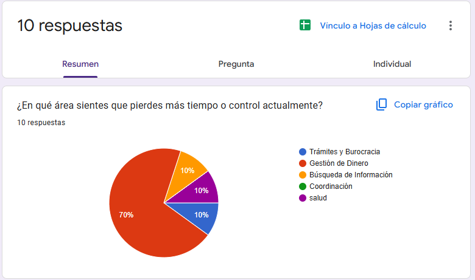

# Taller:  - Arquitectura de Control Financiero

## Sección A: Evidencia de Campo (Discovery)
**El Problema:** "Nunca sé en qué me gasto la plata del semestre y siempre termino pidiendo prestado".
* **Resultados de la Sonda:** El 70% de los encuestados sufre por falta de control en sus gastos.
* **Frecuencia:** 4/5 (Problema recurrente).

[ENLACE AL FORMS](https://docs.google.com/forms/d/1VTHnBeltYuR9JgazDOLH5D2pUcDJDJqBrCKLw2AKsaY/edit#responses)

## Sección B: Definición de Requisitos 
* **Historia de Usuario:** Como estudiante , quiero registrar mis gastos diarios por categorías, para ver gráficamente en qué estoy malgastando mi dinero.
* **Criterios de Aceptación:**
 1. Registro en menos de 10 segundos.
2. Alerta visual (color rojo) si supero el presupuesto.
3. Funcionamiento offline (sin internet).
* **Requisitos Funcionales:**
    1. RF-01: El sistema debe almacenar registros en base de datos local.
    2. RF-02: El sistema debe calcular sumatoria de gastos contra presupuesto.
    3. RF-03: El sistema debe generar reportes con gráficos de torta.
